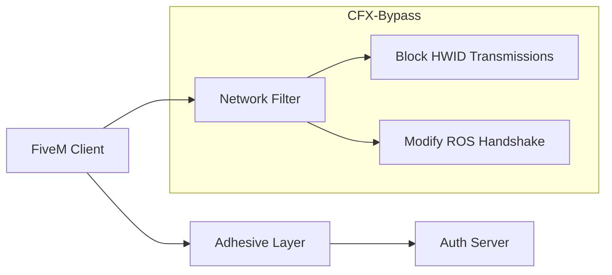

# 🔐 CFX-Bypass - HWID Restriction Workaround

*Advanced network filtering solution for circumventing FiveM hardware bans*

[](https://github.com/yourusername/CFX-Bypass) 
[](https://discord.gg/t8WMq5JKaK)

## ⚡ Core Technology


https://user-images.githubusercontent.com/94861415/149637151-cccf9bbc-be1d-4287-9bb1-375e6efdb87b.mp4

## 🛡️ Key Features
- Real-time packet inspection

- HWID spoofing at network layer

- Rockstar Social Club (ROS) token protection

- Automatic signature mutation

- Stealth mode operation

## 🔥 Critical Notes
```diff
+ Always enable before server exit
+ Use ONLY with new Rockstar accounts
- Never launch FiveM without bypass
```